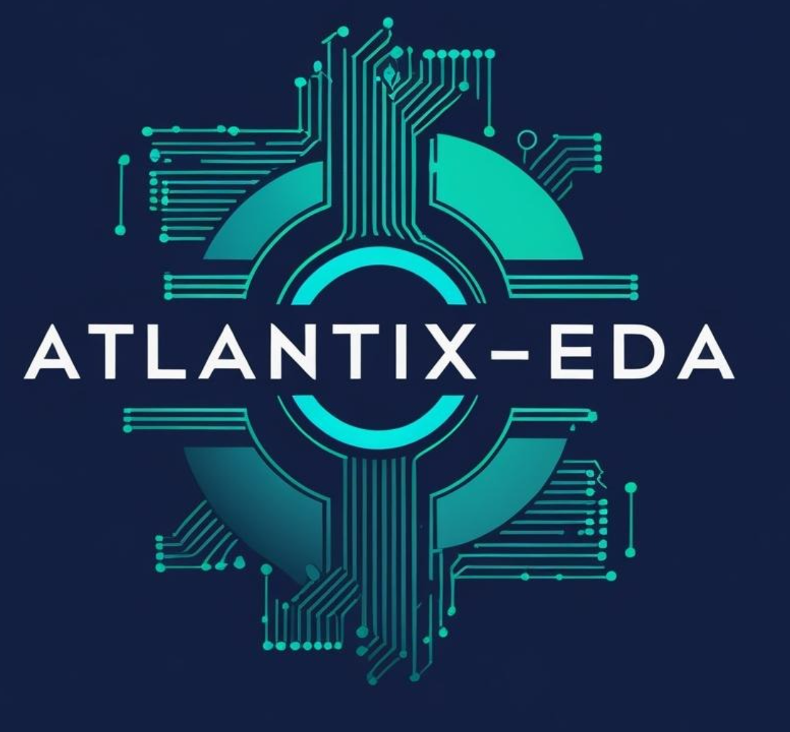
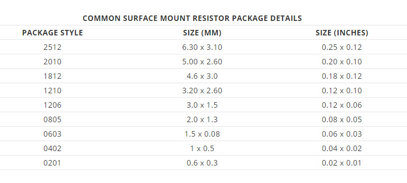

<div align="center">
</img>

## *Modern and Modular PCB Design*

[](https://github.com/emilk/egui)
[](https://www.kicad.org/)
[](https://blog.rust-lang.org/2022/11/03/Rust-1.65.0.html)
[](https://opensource.org/licenses/GPL)

</div>

Programmatically generated PCB libraries facilitating robust electronic product design, and associated tools for parsing and data extraction from KiCad files.

Atlantix-EDA enables electronic engineers to have fully customizable, rich libraries to employ in designs.
The Atlantix-EDA software tool suite *value position* is based upon programmatically generated libraries for PCB Design
with the advantages of:

   - Rapid design creation with consistent and comprehensive PCB libraries.

   - Higher productivity for individual engineers doing schematic, pcb, firmware, etc.

   - Versatile and flexible, as the libraries are programmatically generated by this software.

When engineers place components in their schematic and change the attributes of the part, this creates an error-prone situation in the design process. Atlantix-EDA libraries are generated programmatically, so the attributes of the part are always correct and consistent. This enables engineers to focus on design, not part creation. In short, these libraries focus on supporting the **correct by design** principle. 

In addition to library generation, being able to **extract** component and design data from KiCad files is a powerful capability for design analysis, BOM generation, and workflow automation. The integrated **KiParse** crate provides robust parsing of KiCad PCB and symbol files, enabling users to programmatically access design information.

Atlantix-EDA is built in Rust, leveraging its performance, safety, and modern tooling to create a reliable and efficient software platform for electronic design automation.

### Crates

| Crate | Description | Lib Name |
|-------|-------------|----------|
| **atlantix-core** | Programmatic component library generation (resistors, footprints, symbols) | `component` |
| **kiparse** | KiCad file format parser for `.kicad_pcb` and `.kicad_sym` files | `kiparse` |

**KiParse** was integrated into this workspace in December 2025, consolidating the Atlantix-EDA Rust ecosystem into a single repository. KiParse provides:
- PCB layer extraction and component position parsing
- Symbol library parsing with property extraction
- BOM extraction from PCB files
- Support for KiCad 6, 7, 8, and 9 file formats


## Workspace Structure

As of v0.2.0, atlantix-eda is organized as a **Cargo workspace** containing multiple crates:

```
atlantix-eda/
├── Cargo.toml              # Workspace manifest
├── crates/
│   ├── atlantix-core/      # Component library generation
│   │   └── src/            # Resistor generation, KiCad/Altium export
│   └── kiparse/            # KiCad file format parser
│       └── src/            # PCB parsing, symbol parsing, BOM extraction
├── assets/                 # Documentation images
├── outputs/                # Generated library files
└── test_outputs/           # Test artifacts
```

## Entity Component System (ECS) Architecture

Atlantix-EDA has been refactored to use the Entity Component System (ECS) paradigm, powered by [Bevy ECS](https://github.com/bevyengine/bevy). This modern architecture provides several benefits, ranging from improved performance to enhanced modularity and extensibility.

### ECS Overview

ECS is a data-oriented design pattern that separates data (Components) from behavior (Systems), with Entities serving as unique identifiers that group components together. In Atlantix-EDA:

- **Entities** represent individual electronic components (e.g., a specific resistor)
- **Components** store properties like resistance value, package size, tolerance, manufacturer data
- **Systems** process and transform this data in a modular, composable way
- **Resources** hold global configuration and shared state

### Why ECS for Component Libraries?

1. **Flexibility**: New component types, properties, or manufacturers can be added without modifying existing code
2. **Performance**: Data-oriented design enables efficient batch processing of thousands of components
3. **Modularity**: Each system has a single responsibility, making the codebase easier to understand and extend
4. **Extensibility**: New output formats or processing steps can be added as independent systems
5. **Query Power**: Complex component searches and filters are naturally expressed through ECS queries

### Architecture Overview

The generation pipeline follows these steps:

1. **Template Creation**: Base entities are spawned with package and E-series information
2. **Value Generation**: Systems calculate all resistor values across decades using E-series formulas
3. **Attribute Assignment**: Systems add descriptions, tolerances, and power ratings
4. **Manufacturer Data**: Systems generate part numbers for multiple manufacturers
5. **Output Formatting**: Systems format data for different CAD tools (KiCad, Altium)

This approach makes Atlantix-EDA highly maintainable and ready for future enhancements like capacitor libraries, different component types, or new CAD tool support.

## Quick Start

### Component Library Generation (atlantix-core)

Generate PCB component libraries from the workspace root:

```bash
# Traditional generation (Altium CSV format)
cargo run -p atlantix-core --example gen_resistor -- --format altium --packages "0402,0603,0805,1206"

# KiCad library generation
cargo run -p atlantix-core --example gen_resistor -- --format kicad --packages "0402,0603,0805,1206,1210,2512"

# ECS-based generation (demonstrates the new architecture)
cargo run -p atlantix-core --example gen_resistor_ecs

# See all options
cargo run -p atlantix-core --example gen_resistor -- --help
```


See `crates/kiparse/README.md` for comprehensive KiParse documentation and examples.

**Example Options:**
- `--format`: Choose `kicad` or `altium` output format
- `--packages`: Comma-separated list of package sizes (e.g., "0402,0603,0805,1206,1210,2512")  
- `--output-dir`: Output directory (default: "outputs")
- `--series`: E-series number - 96, 48, or 24 (default: 96)
- `--symbol-style`: For KiCad, choose "european" or "american" resistor symbols

### KiCad File Parsing (kiparse)

Parse KiCad files and extract component data:

```bash
# Parse a PCB file and show layer information
cargo run -p kiparse --example get_layers -- path/to/board.kicad_pcb

# Extract component positions from a PCB
cargo run -p kiparse --example get_positions -- path/to/board.kicad_pcb

# Parse symbol libraries
cargo run -p kiparse --example get_symbols -- path/to/symbols.kicad_sym

# Use the CLI tool
cargo run -p kiparse --features cli -- --help
```

### Legacy Support

The original Vishay resistor example remains available for backward compatibility:

```bash
cargo run --example gen_vishay_resistor
```

This generates Altium-compatible CSV files in the traditional format. 

 ## Software

 This software platform is built with the [Rust](https://www.rust-lang.org/) programming language, offering a very robust
 systems programming language that is type and thread safe. Rust was chosen as the software for Atlantix-EDA
 because of these features and a forward-looking vision incorporating advanced capabilities.

# License

Licensed under GNU General Public License (GPL).

Copyright, 2006-2025, Atlantix-EDA, Atlantix Engineering <atlantix-eda@proton.me>

# Integration

## KiCad Integration ✅

Atlantix-EDA now natively supports **KiCad** library generation:

- **Symbol Libraries**: Generates `.kicad_sym` files with proper S-expression format
- **Footprint Libraries**: Creates `.kicad_mod` files following IPC-7351 standards  
- **Package Support**: 0201, 0402, 0603, 0805, 1206, 1210, 2010, 2512
- **Import Process**: 
  1. Copy symbol files to your KiCad project or global library directory
  2. Copy the `.pretty` footprint directory to your KiCad footprint libraries
  3. Add libraries via Symbol Library Manager and Footprint Library Manager

Browsing the generated libraries in KiCad is straightforward, and they can be used directly in your designs. An example gif is shown below, where one simply needs to type "R0603" in the symbol search box to find the generated resistor symbols. Likewise, if one generates 0805, 1206, or other sizes, they will also be easily searchable in the same way. 


## Altium Integration

Altium Designer database import is described here:   
<https://www.altium.com/documentation/altium-designer/working-with-database-libraries-ad>

The generated CSV files can be directly imported into Altium's Database Library system.

## Other EDA Tools

- **Fusion 360 (Eagle)**, **Cadence Allegro**, and **Mentor PADS**: Not currently supported but could be added
- **PADS**: Was tested with an older version of this software and should be easily adoptable

Overall, resistor libraries now support both KiCad and Altium, covering every E-96 value from 0201 to 2512 - over 5,000 parts per format.

# Background

For a complete resistor library from 0201 to 2512 in the E-96 1% series there are 5,184 resistor values. The ability to generate these libraries on the fly
and change any data associated with each part is quite powerful.

The use of Atlantix-EDA to generate the resistor library enables engineers developing in tools such as Altium, KiCad, etc. to have a comprehensive library 
available to them. This library enables quicker design cycles by
eliminating part creation and more robust design as BOM generation from the schematic will be accurate and true.



A history and more complete background of the [resistor series.](https://en.wikipedia.org/wiki/E_series_of_preferred_numbers "Wikipedia resistor series background")


## Basic usage example
This basic example shows the generation of a 0603 library with
the decades ranging from 1 ohm to 1 Meg-Ohm

```rust
let decades = [1,10,100,1000,10000,100000];
let mut r0603 = component::Resistor::new(96, "0603".to_string());

for decade in decades.iter() {
r0603.generate(*decade);
}
```

## Detailed usage example
The code below shows how to actually instantiate the resistor object and generate
values across several decade values while writing to a file, which is then imported
by Altium or another tool.

```rust
fn main() {
 	let decades = [1,10,100,1000,10000,100000];
	let mut name_0402 : String = " ".to_string();

	let mut r0402 = component::Resistor::new(96, "0402".to_string());

	for decade in decades.iter() {
		name_0402 = r0402.generate(*decade);
	}

 	let mut file = OpenOptions::new()
                       .write(true)
                       .truncate(true)
                       .open("data.txt")
                       .expect("cannot open file");

			file.write_all(name_0402.as_bytes()).expect("write failed");

			println!("** Success::0402 resistor generation.");
 	}
```

# Future Developments

### Component Library Expansion
- **Additional Vendors**: KOA-Speer, Panasonic, Yageo manufacturer part number generation
- **Current Sensing Resistors**: Specialized libraries for power supply designs
- **Capacitor Libraries**: MLCC, electrolytic, and film capacitors with proper derating data
- **Inductor Libraries**: Power inductors, ferrite beads, and common-mode chokes

### KiParse Enhancements
- **Schematic Parsing**: Full `.kicad_sch` file support for hierarchical designs
- **Design Rule Extraction**: Parse DRC settings from `.kicad_pro` files
- **3D Model Management**: Extract and validate 3D model paths from footprints

### Workspace Integration
- **Stencil**: KiCad project manager integrating kiparse for BOM extraction and design analysis
- **Cross-crate Features**: Unified component database shared between generation and parsing 
